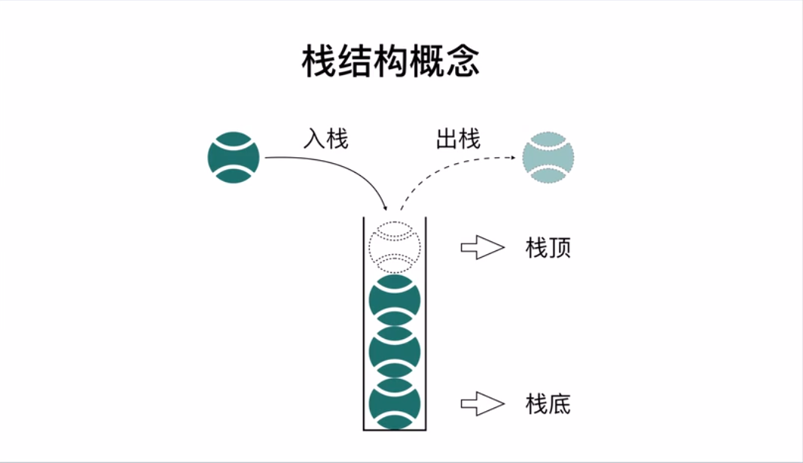
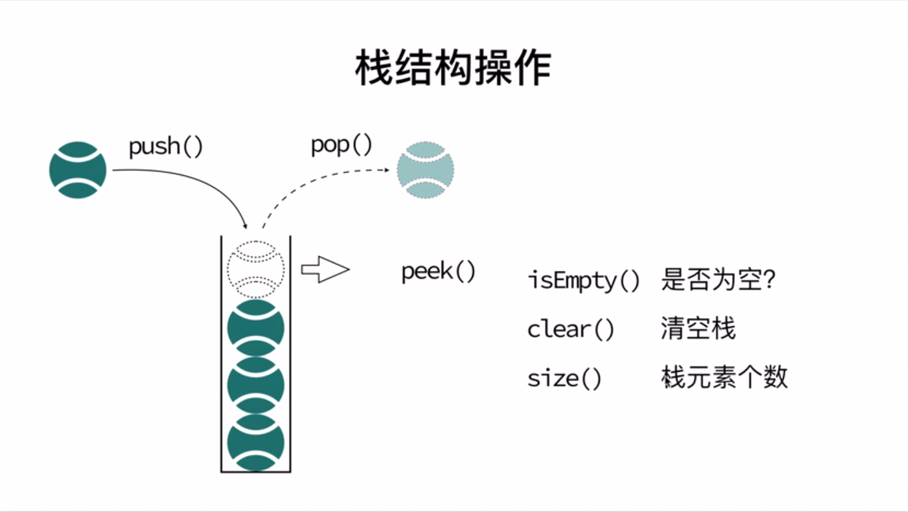
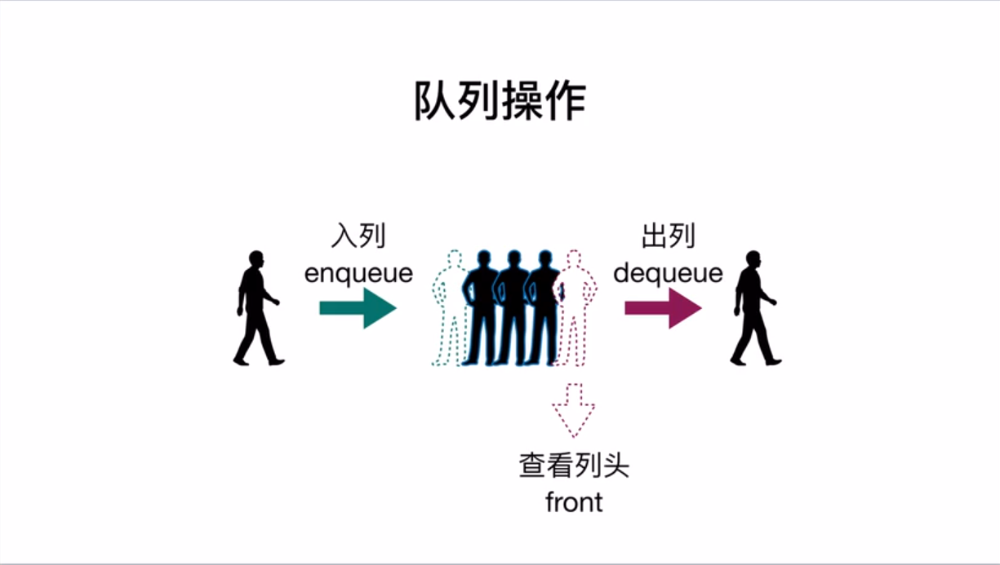
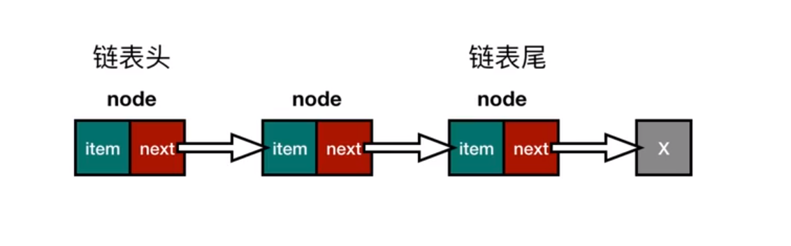
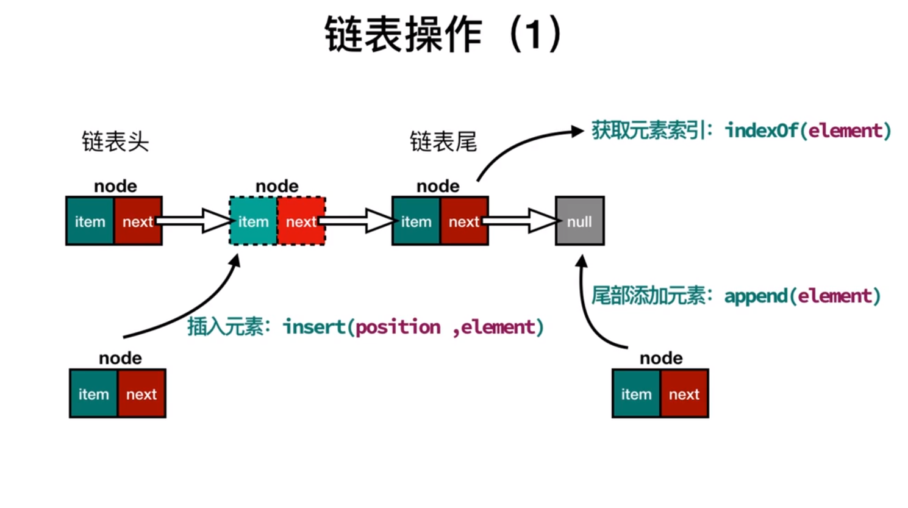
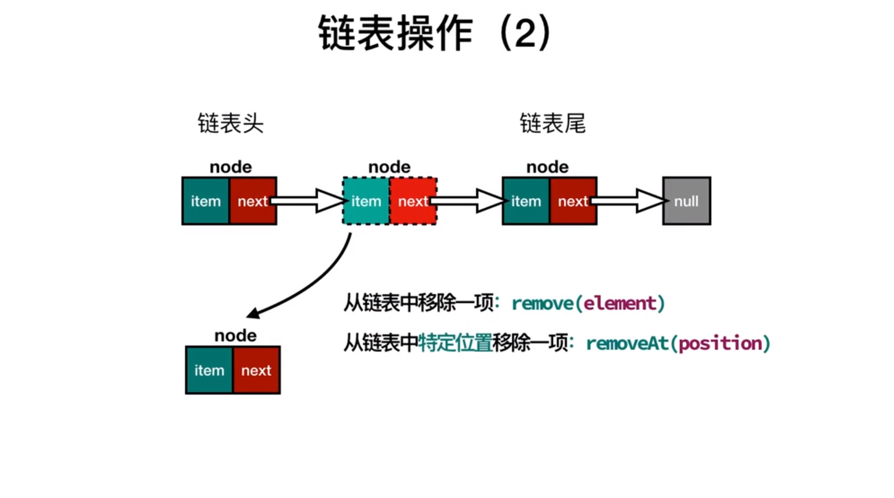
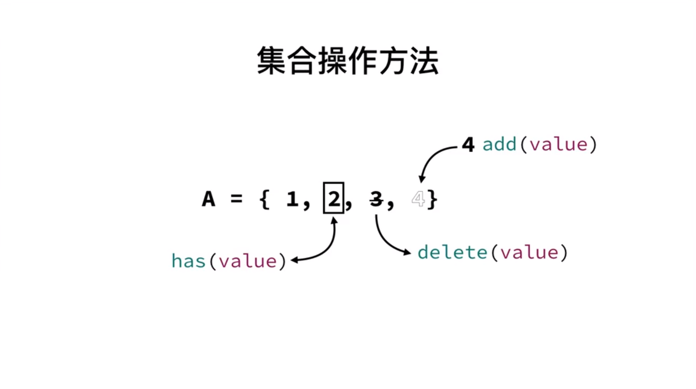
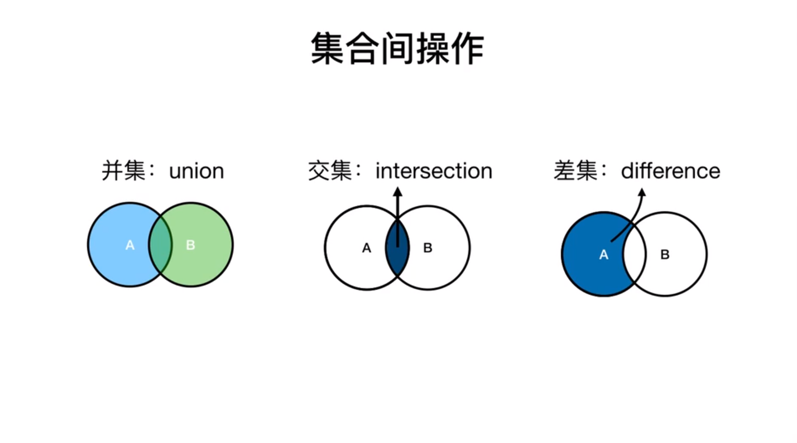
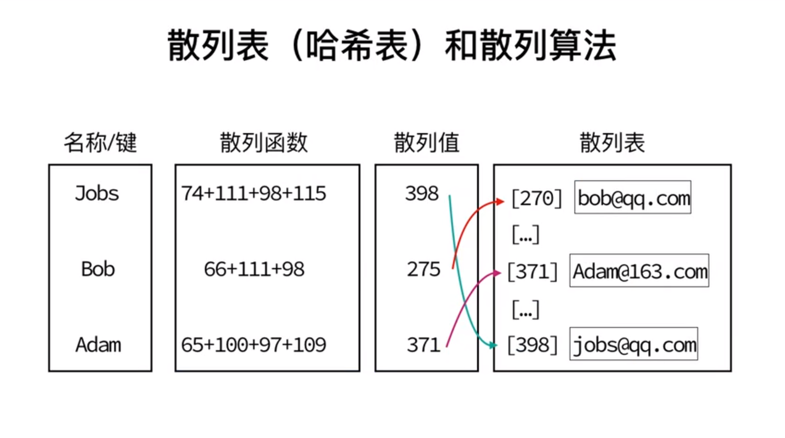

# JavaScript数据结构(JavaScriptDataStructure)
[TOC]
## 一、数据结构 
### 1.1 栈(stack)
> **定义：** 一种先进后出（LIFO）的数据结构







**<font size="6">栈的方法实现</font>**

| 方法名  | 操作           |
| ------- | -------------- |
| push    | 栈顶添加元素   |
| pop     | 栈顶移除元素   |
| peek    | 查看栈顶       |
| isEmpty | 检查栈是否为空 |
| clear   | 移除全部元素   |
| size    | 获取栈的长度   |

[**<font size="6">代码示例:</font>**](./js/Stack.js)
``` javascript

//定义一个栈的类
var Stack = function () {

    //创建栈的载体数组items
    var items = [];

    //push栈顶添加元素
    this.push = function (element) {
        items.push(element);
    }

    //pop移除栈顶元素
    this.pop = function () {
        return items.pop();
    }

    //peek获取栈顶
    this.peek = function () {

        return items[items.length - 1];
    }

    //isEmpty检查栈是否为空
    this.isEmpty = function () {
        return items.length === 0;
    }

    //clear清空栈
    this.clear = function () {
        items = [];
    }

    //size获取栈的大小
    this.size=function(){
        return items.length;
    }
    
    //获取整个栈
    this.getitems = function () {
        return items;
    }
}
```

### 1.2队列 (Queue)
> **定义:** 一种先进先出（FIFO）的数据结构


**<font size="6">栈的方法实现</font>**

| 方法名  | 操作           |
| ------- | --------------|
| enqueue | 入队          |
| dequeue | 出对          |
| front   | 查看队列头    |
| isEmpty | 检查队列是否为空|
| size    | 获取队列的长度 |

[**<font size="6">代码示例:</font>**](./js/Queue.js)
```javascript
var Queue = function () {
    //使用数组作为队列的载体
    var items = [];

    //入列
    this.enqueue = function (element) {
        items.push(element);
    }

    //出列
    this.dequeue = function () {
        return items.shift();
    }

    //查看队列头
    this.front = function () {
        return items[0];
    }

    //检查队列是否为空
    this.isEmpty = function () {
        return items.length === 0;
    }

    //获取队列长度
    this.size=function(){
        return items.length;
    }

    //获取全部队列
    this.getItems=function(){
        return items;
    }
}

```
### 1.3链表(LInkedList)
> **定义：** 链表中的每一个元素都带有下一个元素的指针，指向下一个元素，就像一列火车，每一列不仅携带自己的乘客（item），还要与下一节火车相连（next）；



**<font size="6">链表的操作:</font>**
| 方法名  | 操作           |
| ------- | --------------|
| insert | 插入元素       |
| append | 尾部添加元素    |
| indexOf| 获取元素索引    |
| remove | 链表中移除某一项|
| removeAt| 链表中特定位置移除一项|
| size    | 链表长度 |



[**<font size="6">代码示例:</font>**](./js/LinkedList.js)
### 1.4集合（Set）
> **定义：** 集合是一种数学中的概念，有以下特点：
1. 无重复性
    A={1,2,2,3}=>A={1,2,3}
2. 空集：
    A={}
3. 子集
    A={1,2,,3}
    B={1,2}
    B=>A 的子集



**<font size="6">集合的操作:</font>**

| 方法名  | 操作           |
| ------- | --------------|
| add(value)   | 添加元素  |
| remove(value)| 移除元素  |
| has(value)   | 元素是否存在|
| clear        | 清空集合|
| value        | 查看集合|
| size         | 集合大小 |

[**<font size="6">代码示例</font>**](./js/LinkedList.js)



**<font size="6">集合间操作:</font>**

以下方法形成一个新的集合且不改变原来的集合
| 方法名  | 操作           |
| ------- | --------------|
| union   | 并集  |
| intersection| 交集  |
| difference | 差集 |
### 1.5字典(dictionary)
> **定义:** 是一种类似集合的数据结构,JS的数据类型对象就是字典的一种实现
 + Set{1:1,2:2}                           ==>   [值：值]对
 + Dictionary{"name":"红楼梦","price":200} ==>  [键:值]对

**<font size="6">字典的主要操作:</font>**

| 方法名  | 操作           |
| ------- | --------------|
| set(key,value)   | 添加键值对  |
| deletet(key)| 通过键值移除元素  |
| has(key) | 检查键 |
| get(key) | 由键获取值|

**字典的的实例：`哈希表`**

能够无需遍历，就实现快速查询某一个元素的值

**<font size="6">散列的方法:</font>**

| 方法名  | 操作           |
| ------- | --------------|
| put(key,value)   | 添加元素  |
| remove(key)| 移除元素  |
| get(key) | 检索值  |

### 1.6树
### 1.7图
## 二、算法
### 2.1 排序
#### 2.1.1 冒泡排序
#### 2.1.2 选择排序
#### 2.1.3 插入排序
#### 2.1.4 归并排序

### 2.2 搜索算法
#### 2.2.1 顺序搜索
#### 2.2.2 二分搜索

### 2.3 算法模式
#### 2.3.1 递归
#### 2.3.2 动态规划
#### 2.3.3 贪心算法
