# JavaScript数据结构(JavaScriptDataStructure)
[TOC]
## 一、数据结构 
### 1.1 栈(stack)
> **定义：** 栈一种`先进后出（LIFO）`的数据结构
* LIFO(last in first out)表示就是后进入的元素, 第一个弹出栈空间. 类似于自动餐托盘, 最后放上的托盘, 往往先把拿出去使用.
* 其限制是仅允许在表的一端进行插入和删除运算。这一端被称为`栈顶`，相对地，把另一端称为`栈底`。
* 向一个栈插入新元素又称作`进栈`、`入栈`或`压栈`，它是把新元素放到栈顶元素的上面，使之成为新的栈顶元素；
* 从一个栈删除元素又称作`出栈`或`退栈`，它是把栈顶元素删除掉，使其相邻的元素成为新的栈顶元素。

* 生活中类似于栈的

    * 自助餐的托盘, 最新放上去的, 最先被客人拿走使用.
    * 收到很多的邮件(实体的), 从上往下依次处理这些邮件. (最新到的邮件, 最先处理)
    * **注意:**  不允许改变邮件的次序, 比如从最小开始, 或者处于最紧急的邮件, 否则就不再是栈结构了. 而是队列或者优先级队列结构.


**<font size="6">栈的方法实现</font>**

| 方法名  | 操作           |
| ------- | -------------- |
| push    | 栈顶添加元素   |
| pop     | 栈顶移除元素   |
| peek    | 查看栈顶       |
| isEmpty | 检查栈是否为空 |
| clear   | 移除全部元素   |
| size    | 获取栈的长度   |

[**<font size="6">代码示例</font>**](./js/Stack.js)

* 程序中什么是使用栈实现的呢?

> 学了这么久的编程, 是否听说过, 函数调用栈呢?
* 我们知道函数之间和相互调用: A调用B, B中又调用C, C中又调用D.
* 那样在执行的过程中, 会先将A压入栈, A没有执行完, 所有不会弹出栈.
* 在A执行的过程中调用了B, 会将B压入到栈, 这个时候B在栈顶, A在栈底.
* 如果这个时候B可以执行完, 那么B会弹出栈. 但是B有执行完吗? 没有, 它调用了C.
* 所以C会压栈, 并且在栈顶. 而C调用了D, D会压入到栈顶.
* 所以当前的栈顺序是: 栈顶A->B->C->D栈顶
* D执行完, 弹出栈. C/B/A依次弹出栈.
* 所以我们有函数调用栈的称呼, 就来自于它们内部的实现机制. (通过栈来实现的)
> **函数调用栈图解:**

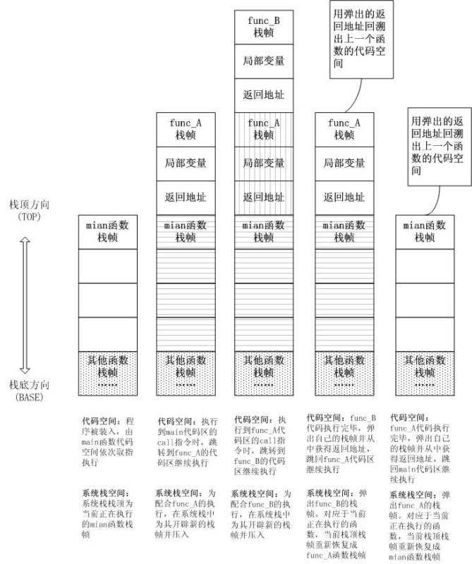

### 1.2队列 (Queue)
> **定义:** 它是一种运算受限的线性表,`先进先出`(FIFO First In First Out)
* 队列是一种受限的线性结构
* 受限之处在于它只允许在表的前端（front）进行删除操作，而在表的后端（rear）进行插入操作

* 生活中类似的队列结构

    * 生活中类似队列的场景就是非常多了, 比如在电影院, 商场, 甚至是厕所排队.
    * 优先排队的人, 优先处理. (买票, 结账, WC)


> **队列在程序中的应用**

* 打印队列:
    * 有五份文档需要打印, 这些文档会按照次序放入到打印队列中.
    * 打印机会依次从队列中取出文档, 优先放入的文档, 优先被取出, 并且对该文档进行打印.
    * 以此类推, 直到队列中不再有新的文档.


* 线程队列:
    * 在进行多线程开发时, 我们不可能无限制的开启新的线程.
    * 这个时候, 如果有需要开启线程处理任务的情况, 我们就会使用线程队列.
    * 线程队列会依照次序来启动线程, 并且处理对应的任务.

**<font size="6">栈的方法实现</font>**


| 方法名  | 操作           |
| ------- | --------------|
| enqueue(element) | 入队          |
| dequeue | 出对          |
| front   | 查看队列头    |
| isEmpty | 检查队列是否为空|
| size    | 获取队列的长度 |

[**<font size="6">代码示例:</font>**](./js/Queue.js)

### 1.3链表(LInkedList)
> **定义：** 链表中的每一个元素都带有下一个元素的指针，指向下一个元素，就像一列火车，每一列不仅携带自己的乘客（item），还要与下一节火车相连（next）；


**<font size="6">链表的操作</font>**

| 方法名  | 操作           |
| ------- | --------------|
| insert(element) | 插入元素       |
| append | 尾部添加元素    |
| indexOf(element)| 获取元素索引    |
| remove(element) | 链表中移除某一项|
| removeAt(postion)| 链表中特定位置移除一项|
| update(position,element)   | 修改元素内容 |
| get(postion)    | 获取链表元素 |
| size    | 链表长度 |


[**<font size="6">代码示例:</font>**](./js/LinkedList.js)

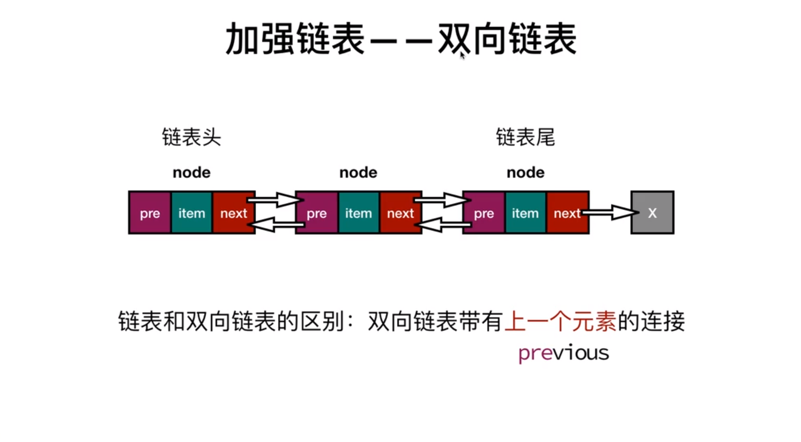
* 单向链表
    * 只能`从头遍历到尾`或`从尾遍历到头`
    * 链表相连的过程是`单向`的
    * 实现的原理是从上一个链表中有一个指向下一个的引用
* 双向链表
    * 既可以`从头遍历到尾`，也可以`从尾遍历到头`
    * 链表的过程是`双向`的
    * 实现原理是既有向前连接的引用，也有一个向后连接的引用

[**<font size="6">代码示例:</font>**](./js/DoublyLinkedList.js)

### 1.4集合（Set）
> **定义：** 集合通常是由一组无序的, 不能重复的元素构成.
* 和数学中的集合名词比较相似, 但是数学中的集合范围更大一些, 也允许集合中的元素重复.
* 在计算机中, 集合通常表示的结构中元素是不允许重复的
* 看成一种特殊的数组
    * 其实集合你可以将它看成一种特殊的数组.
    * 特殊之处在于里面的元素没有顺序, 也不能重复.
    * 没有顺序意味着不能通过下标值进行访问, 不能重复意味着相同的对象在集合中只会存在一份.


**<font size="6">集合的操作</font>**

| 方法名  | 操作           |
| ------- | --------------|
| add(value)   | 添加元素  |
| remove(value)| 移除元素  |
| has(value)   | 元素是否存在|
| clear        | 清空集合|
| value        | 查看集合|
| size         | 集合大小 |

> 集合的实现

* 我们要像之前学习其他数据结构一样, 来学习一下集合.
* 最主要的学习方式就是封装一个属于自己的集合类, 并且可以通过该类进行集合相关的操作.
    * 2011年6月份发布的ES5中已经包含了Array类
    * 2015年6月份发布的ES6中包含了Set类, 所以其实我们可以不封装, 直接使用它.
* 但是这里, 为了明确集合的内部实现机制, 我们这里还是自己来封装一下这个Set类.

[**<font size="6">代码示例</font>**](./js/LinkedList.js)


**<font size="6">集合间操作</font>**

以下方法形成一个新的集合且不改变原来的集合
| 方法名  | 操作           |
| ------- | --------------|
| union   | 并集  |
| intersection| 交集  |
| difference | 差集 |

### 1.5字典(dictionary)
> **定义:** 是一种类似集合的数据结构,JS的数据类型对象就是字典的一种实现
 + Set{1:1,2:2}                           ==>   [值：值]对
 + Dictionary{"name":"红楼梦","price":200} ==>  [键:值]对
> 数组-集合-字典是几乎编程语言都会默认提供的数据类型.在JavaScript中默认提供了数组, 但没有提供集合和字典(ES6中增加了).

#### **字典的介绍**

* 生活中的字典
    * 中文字典我们可以根据拼音去查找汉字, 并且找到汉字对应的词以及解释.
    * 英文字典也是类似, 根据英文字母找到对应的单词, 再查看其翻译和应用场景.
    * 很多编程语言中都有字典的概念
* 字典有什么特点呢?
    * 字典的主要特点是一一对应的关系.
    * 比如保存一个人的信息, 在合适的情况下取出这些信息.
    * 使用数组的方式: [18, "Coderwhy", 1.88]. 可以通过下标值取出信息.
    * 使用字典的方式: {"age" : 18, "name" : "Coderwhy", "height": 1.88}. 可以通过key取出value
* 字典的映射关系:
    * 有些编程语言中称这种映射关系为字典, 因为它确实和生活中的字典比较相似. (比如Swift中Dictionary, Python中的dict)
    *有些编程语言中称这种映射关系为Map, 注意Map在这里不要翻译成地图, 而是翻译成映射. (比如Java中就有HashMap&TreeMap等)

* 字典和数组:
    * 字典和数组对比的话, 字典可以非常方便的通过key来搜索对应的value, key可以包含特殊含义, 也更容易被人们记住.
* 字典和对象:
    * 很多编程语言(比如Java)中对字典和对象区分比较明显, 对象通常是一种在编译期就确定下来的结构, 不可以动态的添加或者删除属性. 而字典通常会使用类似于哈希表的数据结构去实现一种可以动态的添加数据的结构.
    * 但是在JavaScript中, 似乎对象本身就是一种字典. 所有在早期的JavaScript中, 没有字典这种数据类型, 因为你完全可以使用对象去代替.
    * 但是这里我们还是按照其他语言经常使用字典的方式去封装一个字典类型, 方便我们按照其他语言的方式去使用字典. (虽然本质上它内部还是用了一个对象, 后面学习完哈希表我会简单谈一下对象和哈希表的关系)

**<font size="6">字典的主要操作</font>**

| 方法名  | 操作           |
| ------- | --------------|
| set(key,value)   | 添加键值对  |
| deletet(key)| 通过键值移除元素  |
| has(key) | 检查键 |
| get(key) | 由键获取值|

**<font size="6">字典的的实例：`哈希表`</font>**

> 哈希表内容比较多，具体可查阅以下两篇文章
> * [哈希表理论](https://www.jianshu.com/p/6e88d63061f2)
> * [哈希表的实现](https://www.jianshu.com/p/70c11dc8ec98)

**<font size="6">散列表实例</font>**

**<font size="6">散列的方法</font>**

| 方法名  | 操作           |
| ------- | --------------|
| put(key,value)   | 添加元素  |
| remove(key)| 移除元素  |
| get(key) | 检索值  |

### 1.6树

> **相关内容**
> * [树结构介绍](https://www.jianshu.com/p/b7d501591eb7)
> * [二叉搜索树讲解](https://www.jianshu.com/p/ad811c95aad3)
> * [红黑树讲解](https://www.jianshu.com/p/00aae4f4d672)

> **树结构示意图：**
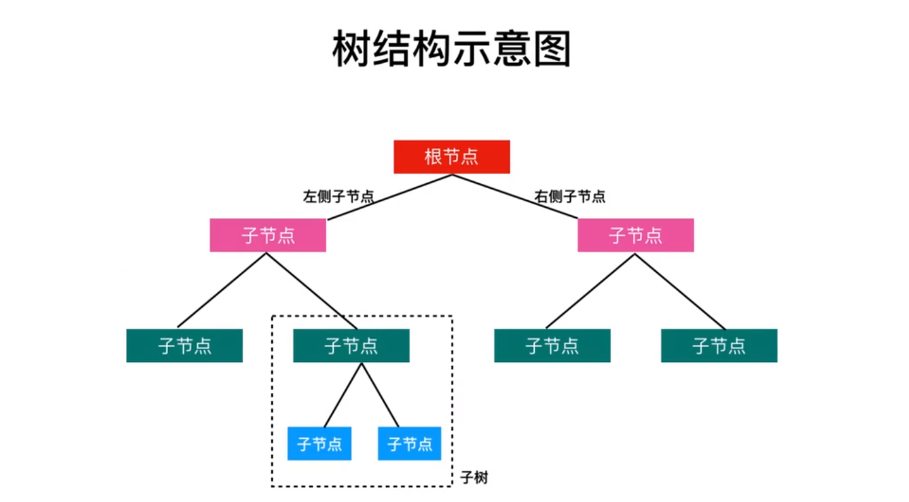

> **实例:**
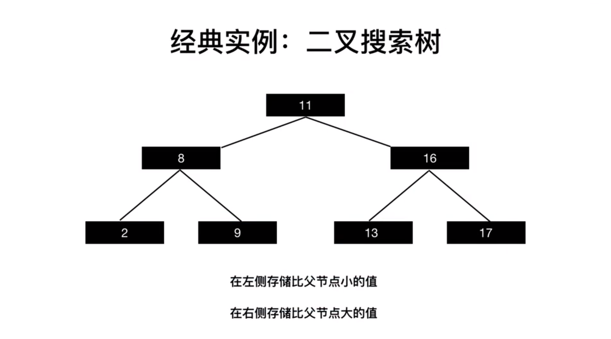

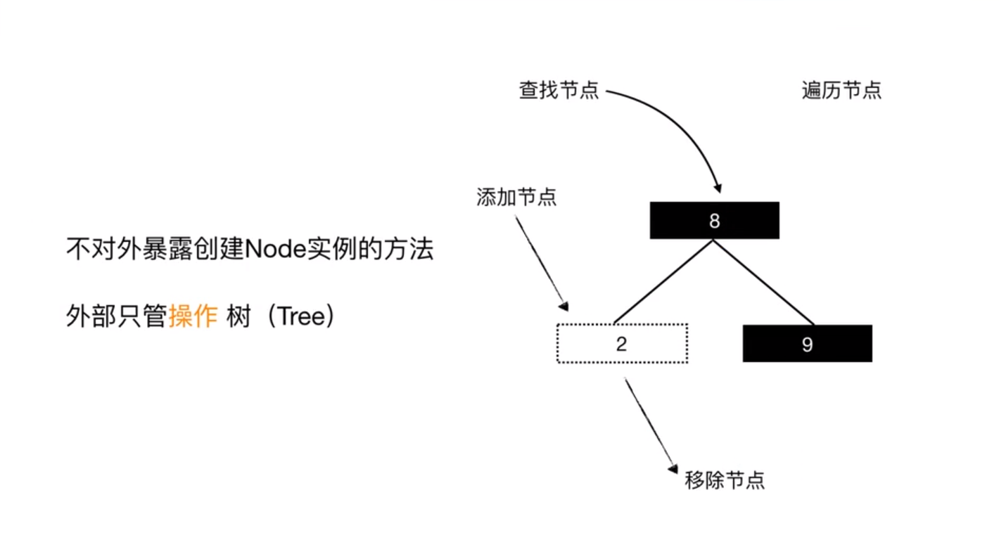
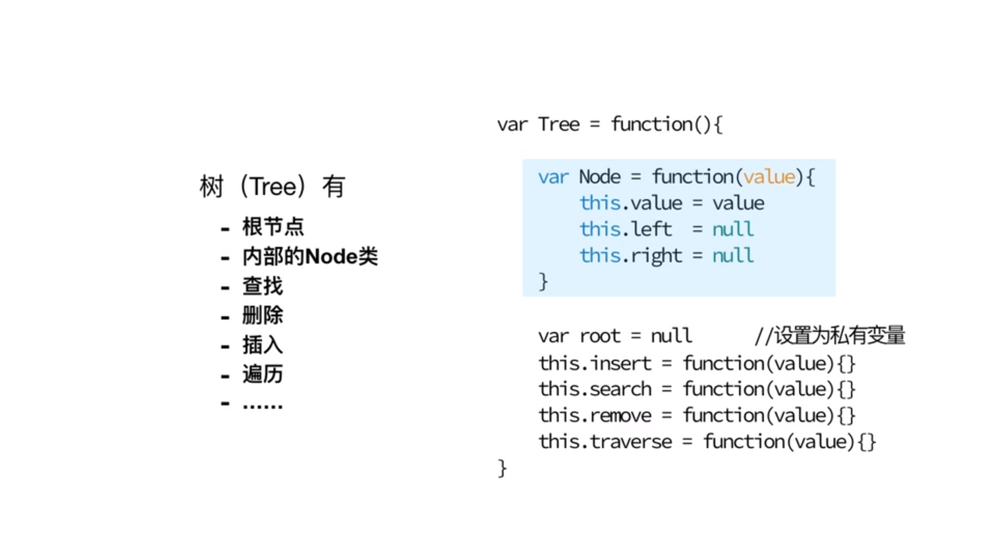
[**<font size="6">代码示例</font>**](./js/Tree.js)

### 1.7图
> **定义：** 图是一种计算机中使用广泛的数据结构
> * [图结构讲解](https://www.jianshu.com/p/85ed85999135)
> * [图算法讲解](https://www.jianshu.com/p/c710de4712d4)

图例
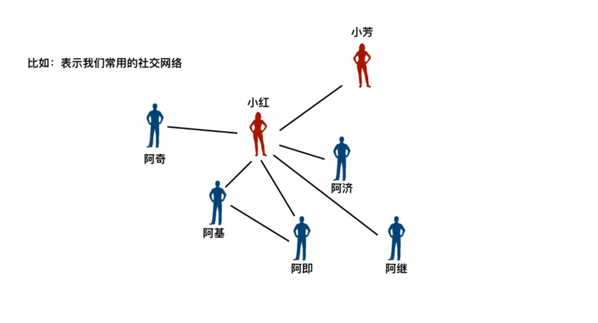
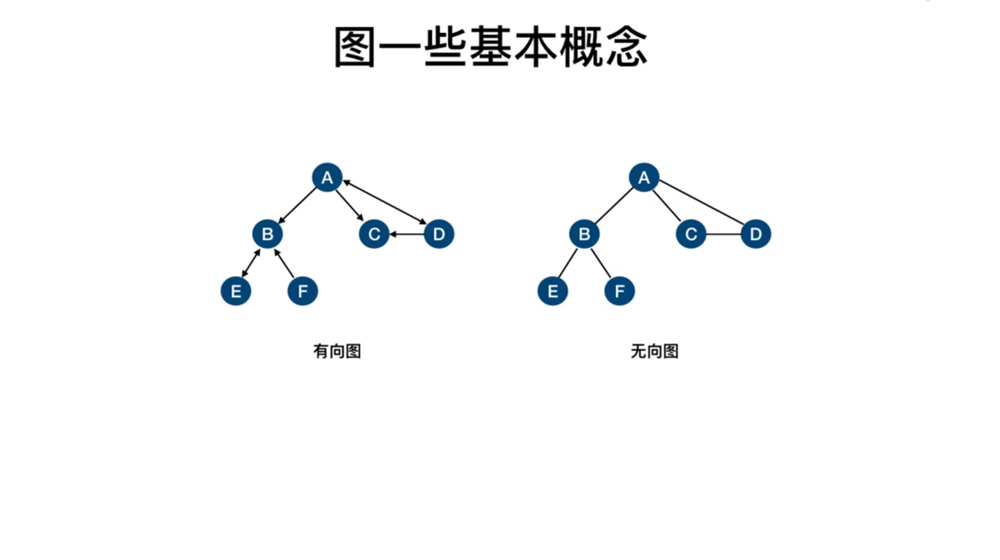
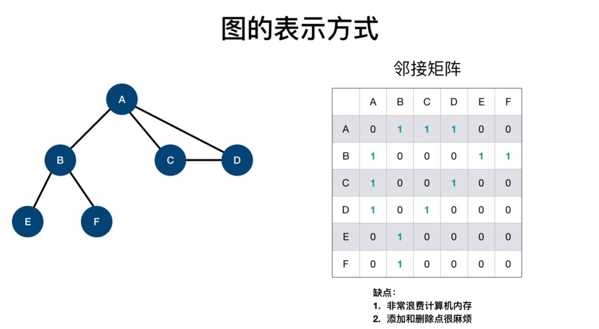
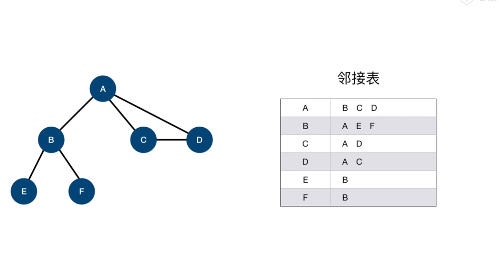
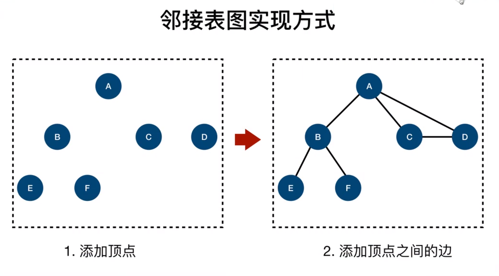
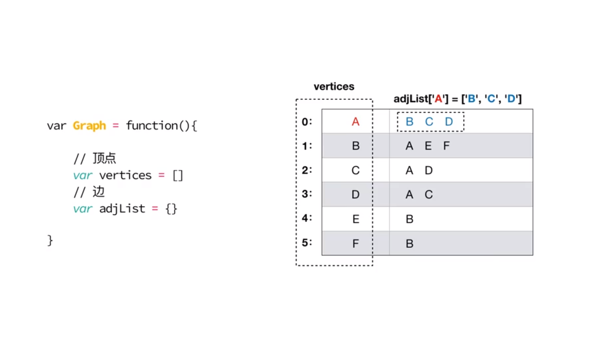
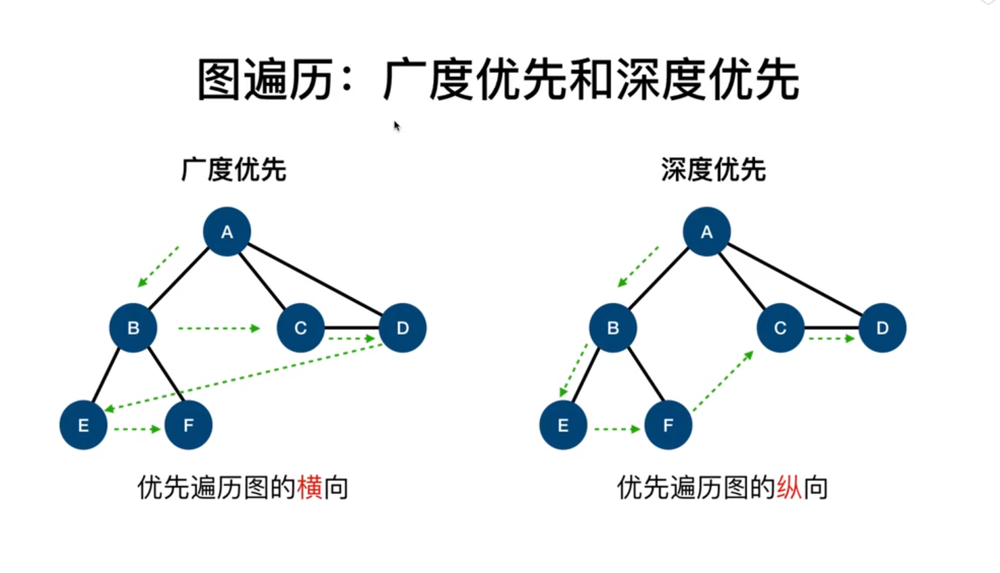
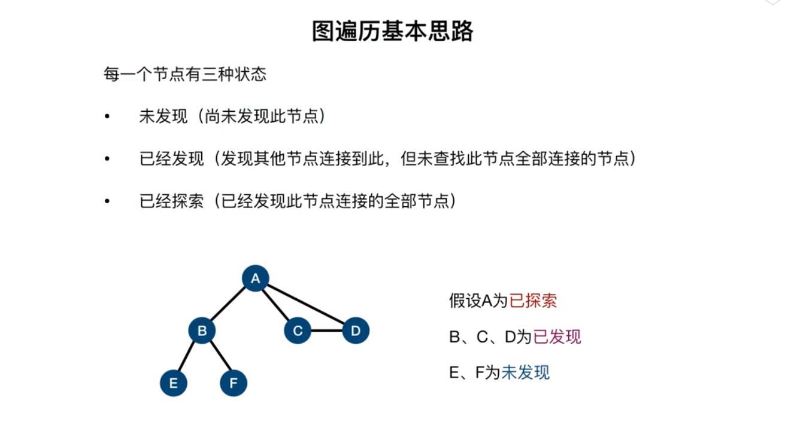
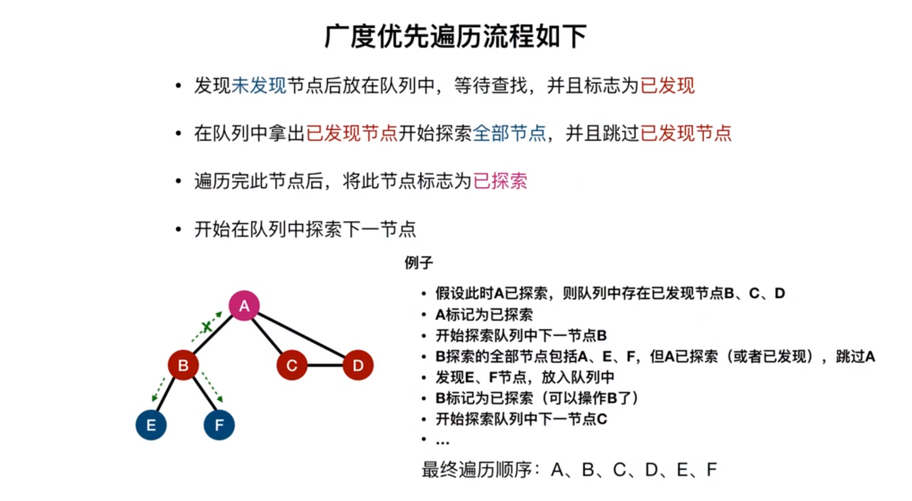
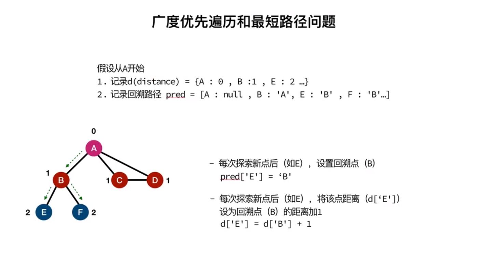
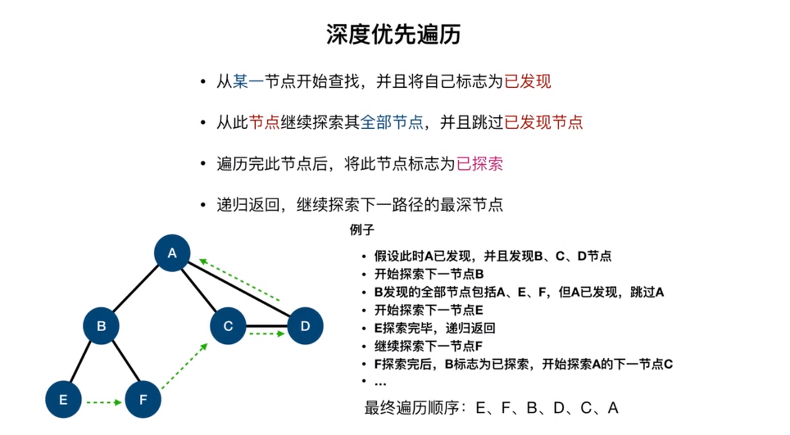
## 二、算法
### 2.1 排序
#### 2.1.1 冒泡排序
* 冒泡排序的思路:
    * 对未排序的各元素从头到尾依次比较相邻的两个元素大小关系
    * 如果左边的队员高, 则两队员交换位置
    * 向右移动一个位置, 比较下面两个队员
    * 当走到最右端时, 最高的队员一定被放在了最右边
    * 按照这个思路, 从最左端重新开始, 这次走到倒数第二个位置的队员即可.
    * 依次类推, 就可以将数据排序完成
* 冒泡排序的图解:

    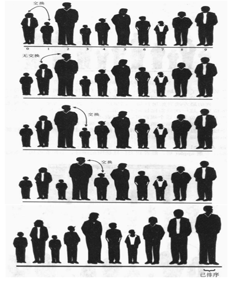

* 思路再分析:
    * 第一次找出最高人放在最后, 我们需要两个两个数据项进行比较, 那么这个应该是一个循环操作.
    * 第二次将次高的人找到放在倒数第二个位置, 也是两个比较, 只是不要和最后一个比较(少了一次), 但是前面的两个两个比较  * 也是一个循环操作.
    * 第三次...第四次...
    * 有发现规律吗? 这应该是一个循环中嵌套循环, 并且被嵌套的循环次数越来越少的.
* 冒泡排序的实现

```javascript
ArrayList.prototype.bubbleSort = function () {
    // 1.获取数组的长度
    var length = this.array.length

    // 2.反向循环, 因此次数越来越少
    for (var i = length - 1; i >= 0; i--) {
        // 3.根据i的次数, 比较循环到i位置
        for (var j = 0; j < i; j++) {
            // 4.如果j位置比j+1位置的数据大, 那么就交换
            if (this.array[j] > this.array[j+1]) {
                // 交换
                this.swap(j, j+1)
            }
        }
    }
}

ArrayList.prototype.swap = function (m, n) {
    var temp = this.array[m]
    this.array[m] = this.array[n]
    this.array[n] = temp
}
```
* 代码解析:
    * 代码序号1: 获取数组的长度.
    * 代码序号2: 我们现在要写的外层循环, 外层循环应该让i依次减少, 因此我们这里使用了反向的遍历.
    * 代码需要3: 内层循环, 内层循环我们使用 j < i. 因为上面的i在不断减小, 这样就可以控制内层循环的次数.
    * 代码需要4: 比较两个数据项的大小, 如果前面的大, 那么就进行交换.


#### 2.1.2 选择排序

#### 2.1.3 插入排序
#### 2.1.4 归并排序

### 2.2 搜索算法
#### 2.2.1 顺序搜索
#### 2.2.2 二分搜索

### 2.3 算法模式
#### 2.3.1 递归
#### 2.3.2 动态规划
#### 2.3.3 贪心算法
